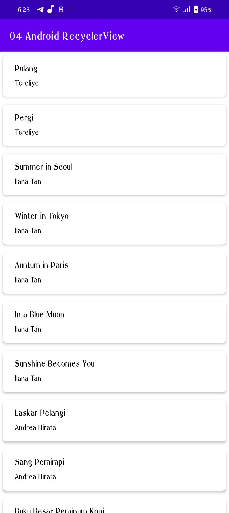
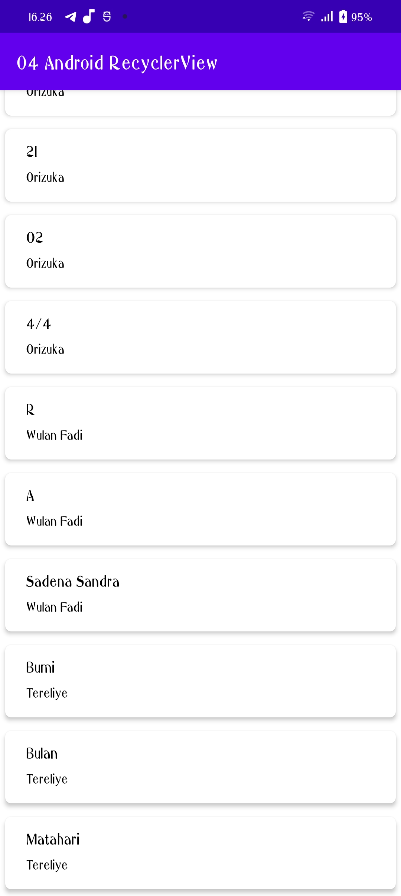

# Laporan Praktikum Pertemuan 4
### Nama : Silvia Prada Aprilia
### NIM : 2041720141
### Kelas : TI-3C
 

1. Buat project baru dengan nama 04 AndroidRecyclerView 
.png)

2. Membuat Dependencies untuk recyclerView
.png)

3. Membuat Layout Utama
.png)

4. Membuat Class Buku
.png)

5. Membuat Layout List.xml
.png)

6. Membuat Class Adapter
.png)

7. Membuat Data yang akan ditampilkan
.png)

8. Memanggil Data untuk ditampilkan melalui MainActivity
.png)

9. Menjalankan Project
.png)

10. Hasil

